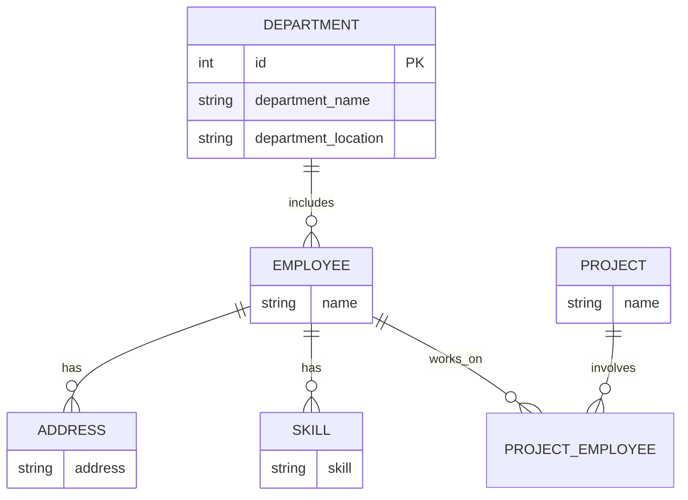
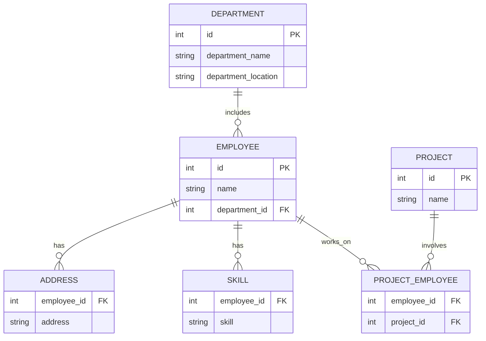

# Diagramma er

# Progettazione Logica

# Normalizzazione

### 1NF
- **EMPLOYEE**: id `PK`, name, department_id, department_name
- **ADDRESS**: employee_id `FK`→ employee.id, address, `PK (employee_id,address)`
- **SKILL**: employee_id `FK`→ employee.id,skill,`PK (employee_id,skill_id)`
- **PROJECT**: id `PK`, name, employee_ids

- **PROJECT_EMPLOYEE**: employee_id `FK`→ employee.id,project_id `FK`→ project.id,`PK (employee_id,project_id)`

### 2NF
- **EMPLOYEE**: id `PK`, name, department_id, department_name
- **ADDRESS**: employee_id `FK`→ employee.id, address, `PK (employee_id,address)`
- **SKILL**: employee_id `FK`→ employee.id,skill,`PK (employee_id,skill_id)`
- **PROJECT**: id `PK`, name, employee_ids

- **PROJECT_EMPLOYEE**: employee_id `FK`→ employee.id,project_id `FK`→ project.id,`PK (employee_id,project_id)`

### 3NF
- **EMPLOYEE**: id `PK`, name,department_id
- **ADDRESS**: employee_id `FK`→ employee.id, address, `PK (employee_id,address)`
- **SKILL**: employee_id `FK`→ employee.id,skill,`PK (employee_id,skill_id)`
- **DEPARTMENT**: id `PK`,department_name,department_location
- **PROJECT**: id `PK`, name
- **PROJECT_EMPLOYEE**: employee_id `FK`→ employee.id,project_id `FK`→ project.id,`PK (employee_id,project_id)`